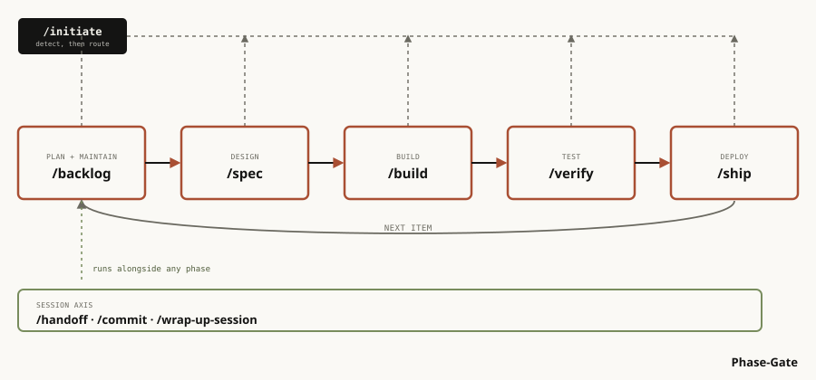

<p align="center">
  
</p>

<h1 align="center">Phase-Gate</h1>

<p align="center">Plan it, build it, review it, ship it — for one person and an AI assistant.</p>

Teams get independent review from a second engineer. Phase-Gate gives you the same thing from a
second AI model reading your work in a fresh conversation. It installs as Claude Code commands, so
**you'll need Claude Code and a git repo to use it.**

New to this and just deciding whether it's worth adopting? Read
[`docs/methodology-explainer.pdf`](docs/methodology-explainer.pdf) instead. No commands in it.

## Features

- **Every change gets sized first**, so a typo fix doesn't get the same process as a rewrite.
- **The plan is reviewed before code exists**, by a model that didn't write it.
- **The finished code is checked against that plan**, by another one that didn't build it.
- **A new conversation starts with no memory of the last one.** In a long session, a hook nudges you
  once you're past 50% of the context window. A handoff note passes what matters to the next
  conversation, so it picks up where you left off instead of starting from zero.
- **Take all of it or one piece.** Nine components work standalone, with nothing to adapt.

## Quick Start

Four steps: clone and copy from a terminal, run the installer inside Claude Code, then one more
terminal command to finish.

**1. Clone this repo anywhere.** It doesn't need to live near your project. In a terminal:

```bash
git clone <this-repo's-clone-url> /path/to/phase-gate
```

**2. Still in a terminal, `cd` into the repo you want Phase-Gate in, then copy the installer there:**

```bash
# macOS and Linux
mkdir -p .claude/skills && cp -r /path/to/phase-gate/installer/phase-gate-install .claude/skills/
```

```powershell
# Windows
New-Item -ItemType Directory -Force .claude\skills | Out-Null
Copy-Item -Recurse C:\path\to\phase-gate\installer\phase-gate-install .claude\skills\
```

**3. In that same terminal, still in your project repo, start Claude Code:**

```bash
claude
```

Then run the installer as a Claude Code command:

```
/phase-gate-install /path/to/phase-gate
```

It asks which mode you want, then lists every component with a verdict for your repo. In `apply` mode
it shows one file's before-and-after at a time and waits for a yes on each. Nothing is written until
you give it.

**4. Back in a terminal, point git at the hooks it installed.** This one is yours to run; the
installer doesn't touch your git config.

```bash
git config core.hooksPath .githooks
```

<details>
<summary>Trying it without changing anything</summary>

Still inside Claude Code from step 3, answer **`recommend-only`** at the mode question. It writes two
files under `.claude/phase-gate-install/` recording what it would propose, and nothing else anywhere.

To try a single standalone component instead, open its folder, copy the one file, and paste its
settings snippet. No installer involved. For example, `block-dangerous-commands`: copy
`standalone/hooks/block-dangerous-commands/block-dangerous-commands.py` into your repo, then merge
`settings.fragment.json` from that same folder into your `.claude/settings.json`.
</details>

## What happens without asking

Not because any of this is risky to run — it's that Phase-Gate acts on your repo in ways worth
knowing up front rather than discovering later.

Phase-Gate commits without asking you first. This is deliberate, so finished work leaves a clean
history without you approving each commit, and the installer confirms it separately from everything
else. You can decline it.

- Commits when a work item is finished and verified, one commit per item.
- Commits just before a large or risky rewrite, as a checkpoint you can return to.
- Commits when wrapping up a session, so finished work doesn't sit uncommitted.
- **Never pushes without asking.** Every push, every time.

Your `CLAUDE.md` is never written to. A `pre-push` hook scans outgoing commits for credentials.

## Usage

You drive this with slash commands, one per stage. Each stage hands the work to the next, and those
hand-offs are where the reviews happen, because the model receiving the work is never the one that
did it.

### Starting and ending a session

`/initiate` is where every session begins: it reads where things stand and tells you what to work on.

| Command | What it does |
|---|---|
| `/initiate` | Opens a session by reading where things stand, then names what to do next |
| `/handoff` | Writes down in-progress work; run it again at the start of a fresh session to resume from it |
| `/end-task` | Closes a session out: commit, sync docs, or write a handoff |

### One change, start to finish

This is the order you'd type these in, and it loops: `/ship` closes one item and points back at
`/backlog` for the next.

| Step | Command | What happens |
|---|---|---|
| **Track** | `/backlog` | Lists open work. Pick an item, or add a new one |
| **Design** | `/spec` | Writes a short plan. You approve it before any code exists |
| **Build** | `/build` | Implements the approved plan, task by task |
| **Check** | `/verify` | A separate reviewer checks the result against that plan |
| **Ship** | `/ship` | Commits, archives the item, and lists what's still open |

### How a change gets sized

`/spec` figures out the tier before it starts writing the plan, so both the tier and the plan itself
can still be refined before any of it reaches `/build`.

| Tier | The change | What it gets |
|---|---|---|
| **1** | A new tool, or rewriting how an existing one works | Fuller plan, automatic review from a different model, option of a second |
| **2** | Several files or new UI, no existing pattern to copy | Short plan, automatic review |
| **3** | Several files or new UI, copying a pattern already working here | Short plan, no review |
| **4** | One spot in one file | One-sentence plan |

### Also included

These cover real, common needs: parallel builds, onboarding an existing project, and reviewing
someone else's pull request.

| Command | What it does |
|---|---|
| `/execution-gate` | Decide, per task, whether the AI does it directly, delegates it, or needs you |
| `/implement-queue` | Build several approved plans at once, each in its own copy of the repo |
| `/adopt` | One-time inventory for adding this to a project that already has code |
| `/consolidate-docs` | Keep your always-loaded rules file from growing unbounded |
| `/periodic-audit` | Check whether tests cover a tool's branches, and whether an old bug is back |
| `/review-pr` | Review a GitHub pull request and post the findings |

Four review agents run behind these commands, each in its own fresh conversation: `code-reviewer`
(the check in `/verify`), `docs-writer` (mechanical documentation updates), and
`periodic-audit-coverage`/`periodic-audit-structural` (the two halves of `/periodic-audit`).

## What it puts in your repo

Phase-Gate keeps its records as four plain markdown files in your own repo, not in a database or a
service, and you can rename any of them. Open work goes in one file; finished work moves to a second
once it ships; a folder holds design plans; and a fourth file logs process mistakes — not bugs in your
code, but times the process itself went wrong, a wrong assumption or a "done" that wasn't actually
checked, so a future session doesn't have to rediscover it the hard way.

The installer creates whichever of the four don't exist yet, one confirmation at a time. Where your
`CLAUDE.md` rules and Phase-Gate's disagree, it shows you the conflict and leaves the decision to you.

The complete list of everything the installer can write is in
[`installer/phase-gate-install/SKILL.md`](installer/phase-gate-install/SKILL.md).

## Standalone components

Each works alone. Most are one file: copy it, paste its settings snippet, done. `doc-review` is a
skill with its own `references/` and `scripts/` subdirectories and no settings snippet at all — copy
its whole folder into `.claude/skills/doc-review/` instead.

| Component | What it does |
|---|---|
| `block-dangerous-commands` | Refuses a short list of catastrophic shell commands outright |
| `hooks-health-check` | Says at session start when your git hooks have come unwired |
| `context-usage-nudge` | Warns as a conversation fills up, so you can hand off in time |
| `update-notification` | Mentions when Phase-Gate has new commits. Never fetches or applies anything |
| `periodic-audit-threshold-check` | Flags when a tool is due for an audit. Needs `/periodic-audit` |
| `statusline` | Context usage, session cost, and elapsed time in your status bar |
| `ai-check` | Scores text for signs an AI wrote it |
| `humanize` | Rewrites text to read less that way |
| `doc-review` | Reviews a document for clarity, checks its claims against the files it cites, and scans it for repeated words and machine-sounding phrasing |

## Requirements

You need three things installed:

- **Claude Code**
- **git**
- **Python 3**

Two commands have their own hard requirement — not optional if you use them, with no fallback if it's
missing:

- **`/implement-queue`** (builds several approved plans in parallel — skip this if you don't use it)
  needs Claude Code's `Workflow` tool with worktree support. Check `/config` to confirm it's on —
  there's no fallback without it.
- **`/review-pr`** (reviews a GitHub pull request — skip this if you don't use it) needs the `gh`
  CLI, authenticated. Install it from
  [cli.github.com](https://cli.github.com), then run `gh auth login`. It also needs Claude Code's own
  `code-review` and `security-review` skills.

The installer itself is a model reading and reasoning about your repo, not a script, so run
`/phase-gate-install` with Sonnet-class reasoning or better — check `/model` if you're not sure what
you're currently on.

Reviews cost real model time. Anything above a one-line fix spends at least one extra agent run, and
usually two — the design review and the QA check are separate passes, and most changes get both. Tier
1 can also switch the whole session to a stronger, more expensive model for the design pass. There's
no spend cap, so watch your usage for the first few sessions.

## Updating

In a terminal, `git pull` the clone. Then, in Claude Code, run `/phase-gate-install /path/to/phase-gate`
again. It compares against what it wrote last time and shows you a plan. Nothing you've edited is
overwritten without a diff first.

Settings live at `.claude/phase-gate-install/variables.json` in your repo. Edit a value there and the
next run reads your edit instead of asking again. [`docs/PORTING.md`](docs/PORTING.md) explains what
each one does.

To remove Phase-Gate, `.claude/phase-gate-install/receipt.json` lists every path it ever wrote.
Delete those, remove its entries from `.claude/settings.json`, and unset `core.hooksPath`.

## Documentation

| Document | What it covers |
|---|---|
| [`docs/methodology-explainer.pdf`](docs/methodology-explainer.pdf) | The idea in plain language, no commands |
| [`docs/methodology.md`](docs/methodology.md) | The full process reference |
| [`docs/WORKFLOW.md`](docs/WORKFLOW.md) | How the commands connect |
| [`docs/PORTING.md`](docs/PORTING.md) | Every configurable setting |
| [`CHANGELOG.md`](CHANGELOG.md) | Release history. Pre-1.0 |

## Licence

MIT, under [`LICENSE`](LICENSE). `ai-check` and `humanize` came from elsewhere and keep their own
licence; see their folders. The idea of distributing small single-purpose hooks individually rather
than as one config comes from
[`claude-code-templates`](https://github.com/davila7/claude-code-templates) (MIT, Daniel Ávila).
